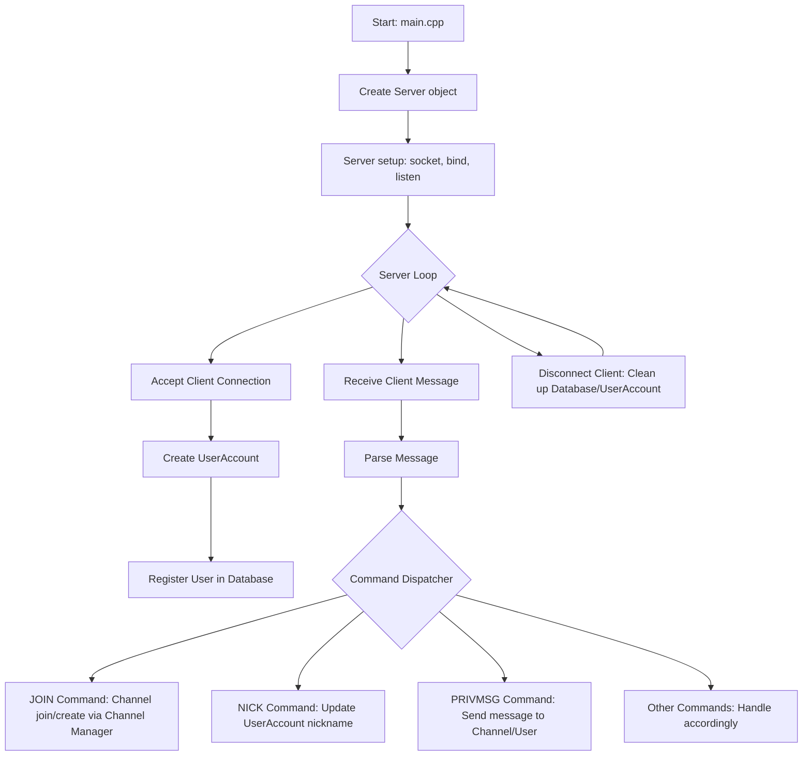

# IRC
Amaging Internet Relay Chat Server

## Flow Chart

```mermaid
flowchart TD
    A[Start: main.cpp] --> B[Create Server object]
    B --> C[Server setup: socket, bind, listen]
    C --> D{Server Loop}
    D --> E[Accept Client Connection]
    E --> F[Create UserAccount]
    F --> G[Register User in Database]
    D --> H[Receive Client Message]
    H --> I[Parse Message]
    I --> J{Command Dispatcher}
    J --> K1[JOIN Command: Channel join/create via Channel Manager]
    J --> K2[NICK Command: Update UserAccount nickname]
    J --> K3[PRIVMSG Command: Send message to Channel/User]
    J --> K4[Other Commands: Handle accordingly]
    D --> L[Disconnect Client: Clean up Database/UserAccount]
    L --> D
```
