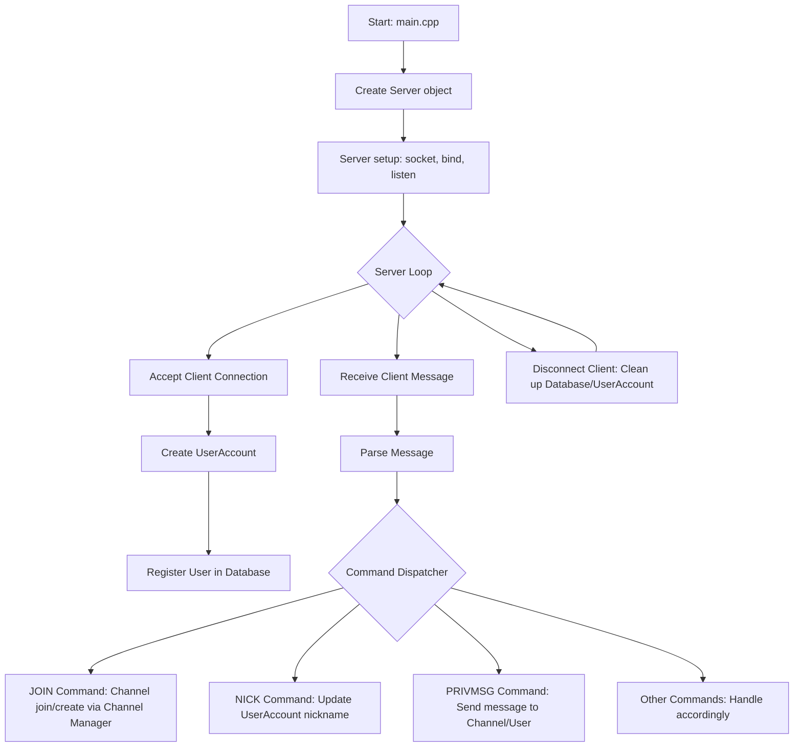

# IRC
Amaging Internet Relay Chat Server

## Introduction

---

## Features

---

## Prerequisites

---

## Installation

---

## Flow Chart

---

## Contributors
<table>
    <tbody>
        <tr>
            <td align="center" valign="top">
                <a href="https://github.com/west-eastH">
                     
                    <b>Seo Donghyeon</b>
                </a>
            </td>
            <td align="center" valign="top">
                <a href="https://github.com/ph-han">
                     
                    <b>Han Pilho</b>
                </a>
            </td>
            <td align="center" valign="top">
                <a href="https://github.com/ph-han">
                     
                    <b>Han Jongmin</b>
                </a>
            </td>
            <td align="center" valign="top">
                <a href="https://github.com/ph-han">
                     
                    <b>Im Hyunsoon</b>
                </a>
            </td>
        </tr>
    </tbody>
</table>
