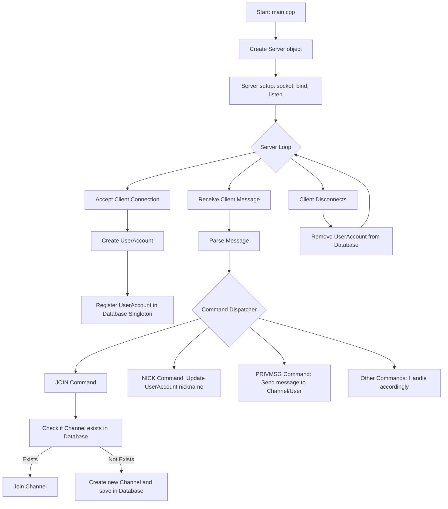

# IRC
Amaging Internet Relay Chat Server

## Introduction
Our team's IRC server is a **C++98-based** implementation that closely follows the IRC standards such as [RFC 1459](https://datatracker.ietf.org/doc/html/rfc1459) and [RFC 2812](https://datatracker.ietf.org/doc/html/rfc2812).
It provides a text-based real-time communication environment and has been tested with clients such as `irssi`.

---

## Features
- I/O Multiplexing: Used **kqueue**.
- Channel Management: Create, join, and leave channels.
- Private Messaging: Send direct messages to other users.
- User Authentication: Secure login with username and password.
- Moderation Tools: Kick, ban users, and manage channels effectively.

---

## Installation

Follow these steps to set up and run the IRC server on your local machine:

1. **Clone the repository**:
    ```bash
    git clone https://github.com/ph-han/IRC.git
    cd IRC
    ```

2. **Build the project**:
    ```bash
    make
    ```

3. **Run the server**:
    ```bash
    ./ircserv <port> <password>
    ```

---

## Usage

Once the server is running, clients can connect to it using an IRC client.

### Example of Connecting with an IRC Client:
- Connect with nc : `nc -c <serverip> <port>`

If you connect this way, you should register userinfo using command PASS, USER, NICK (Check IRC Protocol)
  
- Connect with IRC Client (e.g., [irssi](https://irssi.org/)) :
```
./irssi
connect -nocap <ip> <port> <password>
```

---

## Flow Chart


---

## Contributors
<table>
    <tbody>
        <tr>
            <td align="center" valign="top">
                <a href="https://github.com/west-eastH">
                    <br />
                    <sub><b>Seo Donghyeon</b></sub>
                </a>
            </td>
            <td align="center" valign="top">
                <a href="https://github.com/ph-han">
                    <br />
                    <sub><b>Han Pilho</b></sub>
                </a>
            </td>
            <td align="center" valign="top">
                <a href="https://github.com/hanjjong">
                    <br />
                    <sub><b>Han Jongmin</b></sub>
                </a>
            </td>
            <td align="center" valign="top">
                <a href="https://github.com/Hyun-Soon">
                    <br />
                    <sub><b>Im Hyunsoon</b></sub>
                </a>
            </td>
        </tr>
    </tbody>
</table>
